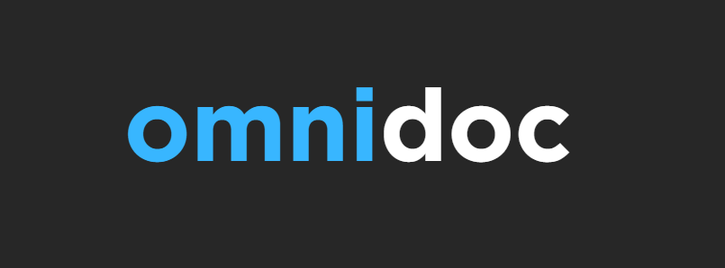
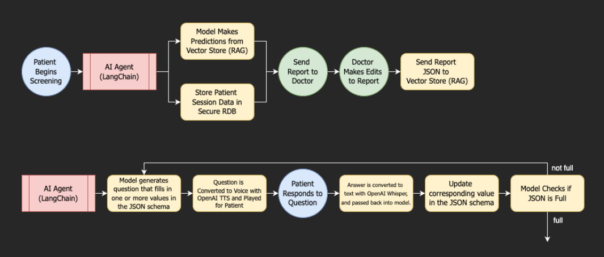

# OmniDoc - Hack OHI/O 2024 - 1st place

  

OmniDoc is a voice-to-voice AI agent designed to streamline the diagnosis of generic illness symptoms into a seamless diagnostic process. 

The AI agent converses with patients in a natural, intuitive manner, through voice interaction, gathering relevant health information and symptoms in real-time. It leverages LangChain sequence chaining alongside Open AI’s Whisper & GPT-4o APIs to understand the patient’s responses, ask follow-up questions, and clarify symptoms. 

Ultimately, it generates a report, accessible within our robust web application built with a Django and Supabase (PostgreSQL) backend, giving doctors more insight/context into their patients prior to seeing them.

  

